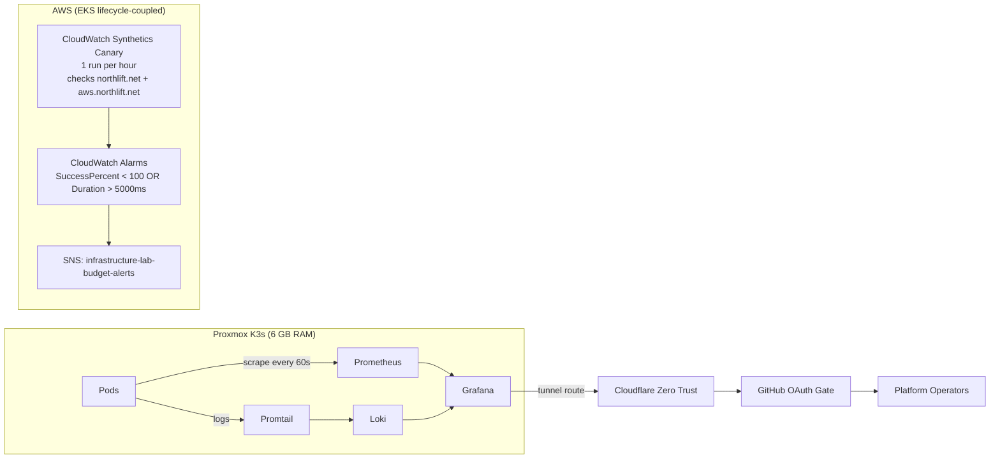

# Phase 13: Full-Picture Observability

Phase 13 introduces a dual-layer observability strategy:

1. Whitebox observability inside K3s with Prometheus + Loki + Grafana.
2. Blackbox uptime validation from AWS with CloudWatch Synthetics.

## Architecture

## Resource Budget

### K3s Observability Limits

| Component | Requests | Limits | Notes |
|---|---|---|---|
| Prometheus | 100m CPU / 192Mi | 300m CPU / 256Mi | Retention 3d, scrape interval 60s |
| Grafana | 50m CPU / 64Mi | 150m CPU / 128Mi | Includes Loki datasource |
| Alertmanager | 20m CPU / 32Mi | 50m CPU / 64Mi | Minimal alert routing footprint |
| kube-state-metrics | 20m CPU / 32Mi | 50m CPU / 64Mi | Cluster object state metrics |
| node-exporter | 10m CPU / 16Mi | 30m CPU / 32Mi | Host/node-level metrics |
| Loki | 50m CPU / 64Mi | 150m CPU / 128Mi | Retention 72h, PVC capped at 5Gi |
| Promtail | 10m CPU / 16Mi | 30m CPU / 32Mi | DaemonSet log shipping |

### Capacity Baseline

| Item | Memory Estimate |
|---|---:|
| K3s platform baseline | ~1.6 Gi |
| Observability stack | ~650 Mi |
| OS safety buffer | ~400 Mi |
| Total baseline | ~2.65 Gi |
| VM provisioned memory | 6.0 Gi |
| Remaining headroom | ~3.35 Gi |

## GitOps Components

| Layer | File |
|---|---|
| ArgoCD app (metrics) | `gitops/apps/observability.yaml` |
| ArgoCD app (logs) | `gitops/apps/loki-stack.yaml` |
| Prometheus/Grafana values | `gitops/values-observability.yaml` |
| Loki/Promtail values | `gitops/values-loki.yaml` |

## Operations

Operational deployment, validation, failure-drill, and lifecycle checks live in the [Phase 13 Observability Runbook](observability-runbook.md).
