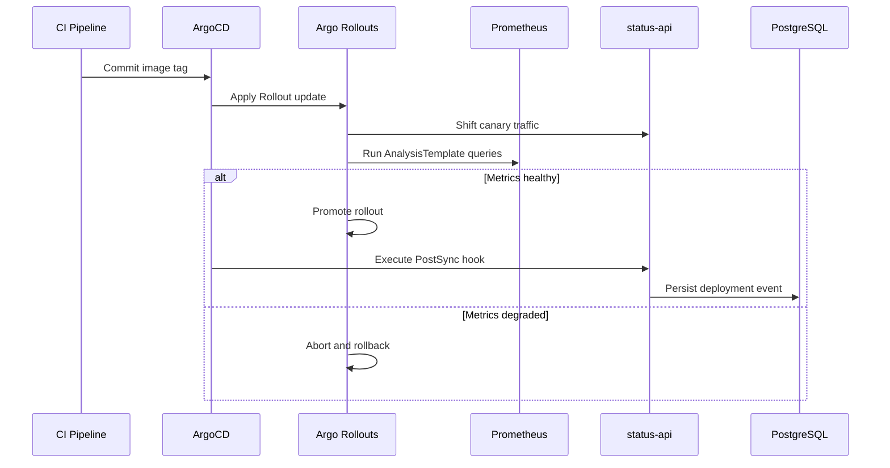

# Phase 14: Progressive Delivery and DORA Metrics

## Scope

Phase 14 upgrades status-api to a PostgreSQL-backed service with deployment event persistence, adopts Argo Rollouts for canary releases, and visualizes DORA metrics in Grafana.

## Canary Flow

## Migration Safety Policy

1. Expand phase migrations are mandatory for pre-promotion rollout windows.
2. Contract phase migrations are deferred to a follow-up release after rollout stability is confirmed.

## Deployment Event Ingestion

1. CI writes OCI labels during image build:
    1. org.opencontainers.image.revision
    2. org.opencontainers.image.created
2. ArgoCD PostSync hook resolves these labels from the image metadata and posts to /api/deployments.
3. The endpoint is token-protected using X-Deploy-Token.
4. Hook failures are intentionally ignored to avoid blocking reconciliation.

## Grafana DORA Datasource Security

1. Grafana uses a dedicated read-only PostgreSQL role: grafana_reader.
2. Role grants are managed by Alembic migration 20260414_0002.
3. Datasource credentials are injected via Kubernetes Secret keys:
    1. host
    2. port
    3. database
    4. username
    5. password

## Operations

Secret generation, rollout verification, deployment-event checks, and Grafana validation live in the [Phase 14 Progressive Delivery Runbook](progressive-delivery-runbook.md).
