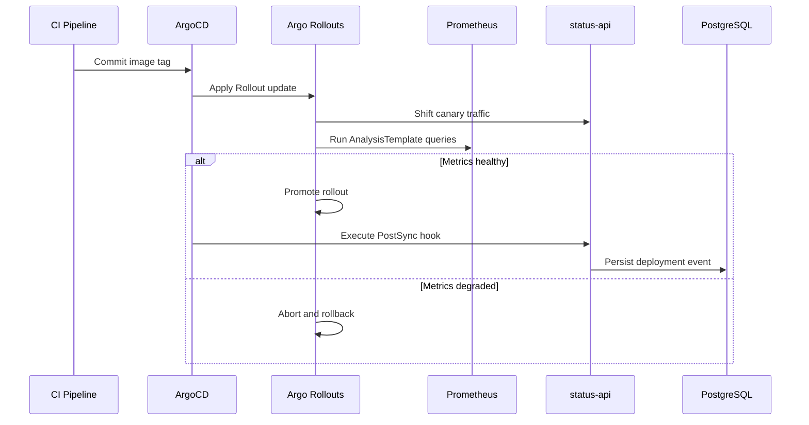

# Phase 14: Progressive Delivery and DORA Metrics

## Scope

Phase 14 upgrades status-api to a PostgreSQL-backed service with deployment event persistence, adopts Argo Rollouts for canary releases, and visualizes DORA metrics in Grafana.

## Canary Flow



## Migration Safety Policy

1. Expand phase migrations are mandatory for pre-promotion rollout windows.
2. Contract phase migrations are deferred to a follow-up release after rollout stability is confirmed.

## Deployment Event Ingestion

1. CI writes OCI labels during image build:
    1. org.opencontainers.image.revision
    2. org.opencontainers.image.created
2. ArgoCD PostSync hook resolves these labels from the image metadata and posts to /api/deployments.
3. The endpoint is token-protected using X-Deploy-Token.
4. Hook failures are intentionally ignored to avoid blocking reconciliation.

## Grafana DORA Datasource Security

1. Grafana uses a dedicated read-only PostgreSQL role: grafana_reader.
2. Role grants are managed by Alembic migration 20260414_0002.
3. Datasource credentials are injected via Kubernetes Secret keys:
    1. host
    2. port
    3. database
    4. username
    5. password

## Secrets Generation Helper

Use scripts/generate_phase14_sealed_secrets.sh to generate SealedSecret manifests for status-api deployment events, app database URL, and Grafana datasource credentials.

### Example: K3s Lab

```bash
export DEPLOY_EVENT_TOKEN="<lab-token>"
export GRAFANA_POSTGRES_HOST="postgresql.monitoring.svc.cluster.local"
export GRAFANA_POSTGRES_PORT="5432"
export GRAFANA_POSTGRES_DATABASE="appdb"
export GRAFANA_POSTGRES_USERNAME="grafana_reader"
export GRAFANA_POSTGRES_PASSWORD="<lab-grafana-reader-password>"

./scripts/generate_phase14_sealed_secrets.sh \
    --profile lab \
    --kube-context k3s-lab \
    --status-api-namespace default
```

### Example: AWS EKS

```bash
export DEPLOY_EVENT_TOKEN="<aws-token>"
export STATUS_API_DB_URL="postgresql+psycopg://appuser:<password>@<rds-endpoint>:5432/appdb"

./scripts/generate_phase14_sealed_secrets.sh \
    --profile aws \
    --kube-context aws-eks-prod \
    --status-api-namespace production
```

Generated files are written to gitops/secrets and can be committed for GitOps reconciliation.

## Cluster Verification Runbook

### 1) Verify Argo apps and Rollout health

```bash
kubectl -n argocd get applications argo-rollouts argo-rollouts-aws status-api-lab status-api-cloud
kubectl -n default get rollout status-api-lab-rollout
kubectl -n production --context aws-eks-prod get rollout status-api-cloud-rollout
```

Expected:
1. Argo apps are Synced and Healthy.
2. Rollout resources are Healthy, not Unknown.

### 2) Verify canary analysis execution

```bash
kubectl -n default get analysisrun
kubectl -n production --context aws-eks-prod get analysisrun
```

Expected:
1. AnalysisRun objects are created during canary steps.
2. Successful analysis promotes rollout automatically.

### 3) Verify PostSync deployment event hook

```bash
kubectl -n default get jobs | grep deploy-event
kubectl -n production --context aws-eks-prod get jobs | grep deploy-event
```

Optional log check:

```bash
kubectl -n default logs job/<deploy-event-job-name>
kubectl -n production --context aws-eks-prod logs job/<deploy-event-job-name>
```

Expected:
1. Hook jobs complete after successful sync.
2. Hook errors do not block app reconciliation.

### 4) Verify deployment events in API and database

```bash
kubectl -n default port-forward svc/status-api-lab-service 18080:80
curl -s http://localhost:18080/api/deployments | jq .
```

Expected:
1. New rows appear after each successful deployment.
2. committed_at and git_sha are populated from OCI labels.

### 5) Verify Grafana datasource and DORA panels

```bash
kubectl -n monitoring get secret grafana-postgres-datasource
```

Expected:
1. Grafana datasource PostgreSQL-DORA is healthy.
2. Deployment Frequency and Lead Time panels return non-empty time series.

## Validation

1. Verify ArgoCD shows Rollout resources as Healthy, not Unknown.
2. Verify AnalysisRun gates canary promotion.
3. Verify /api/deployments receives one event after successful sync.
4. Verify Grafana DORA dashboard queries return data from PostgreSQL.
