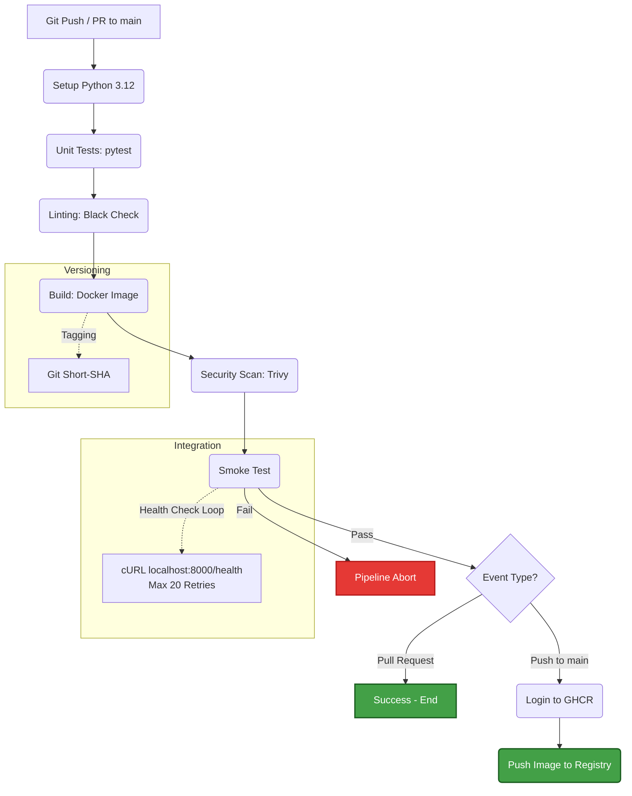

# Containerization & CI/CD Pipeline

This document outlines the containerization strategy for the FastAPI application and the automated build process via GitHub Actions. The focus is on hardware efficiency (Cloud Builds instead of local builds) and strict versioning.

## 1. ADR-003: Cloud-Native Builds & GHCR

* **Risk:** Running local `docker build` processes on the resource-constrained Proxmox host creates high CPU/IO load. Furthermore, manual builds lead to inconsistent image versions.
* **Business Value:** An automated CI/CD pipeline shifts the compute load to the cloud (GitHub Actions) and guarantees that only tested (Smoke Test) and format-compliant (Black) code is pushed as a container image to the registry (GHCR).
* **Cost:** $0. Utilizing the built-in GitHub Runners and the free GitHub Container Registry (GHCR).

---

## 2. Pipeline Architecture

The workflow differentiates between Pull Requests (Build & Test only) and Pushes to the `main` branch (Build, Test & Push to Registry).



---

## 3. Implementation Details
The pipeline (`.github/workflows/docker-builder.yml`) enforces the following best practices:

### 3.1 Traceable Versioning
The `latest` tag is strictly prohibited. Every image is tagged with the Git Short-SHA of the respective commit. This guarantees a 1:1 mapping between the running container and the source code.

```bash
SHORT_SHA=$(git rev-parse --short HEAD)
IMAGE_TAG="ghcr.io/northlift/status-api:${SHORT_SHA}"
```

### 3.2 Resilient Smoke Testing
Before an image is published, the runner spins up the container locally. A polling loop checks the `/health` endpoint for up to 20 seconds. If the container does not respond with an HTTP 200 OK, the build is immediately aborted, and the logs of the failing container are printed for debugging.

### 3.3 Secure Registry Authentication
Authentication against the GitHub Container Registry (GHCR) is handled exclusively via the temporary `${{ secrets.GITHUB_TOKEN }}`. No static Personal Access Tokens (PAT) or plaintext passwords are stored in the code or repository secrets.

```yaml
- name: Login to GHCR
  uses: docker/login-action@v3
  with:
    registry: ghcr.io
    username: ${{ github.actor }}
    password: ${{ secrets.GITHUB_TOKEN }}
```
